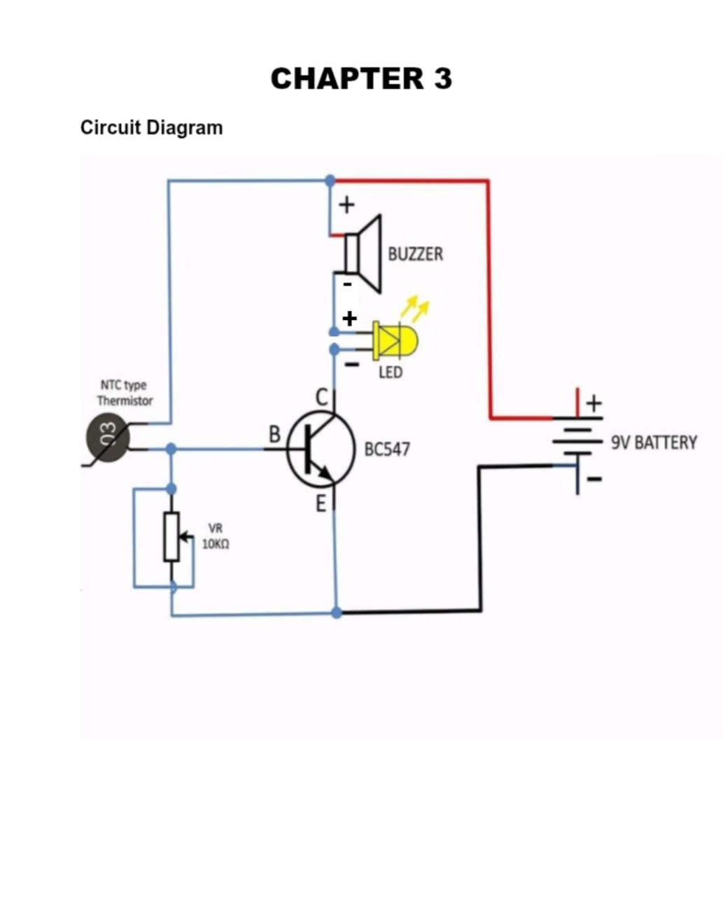
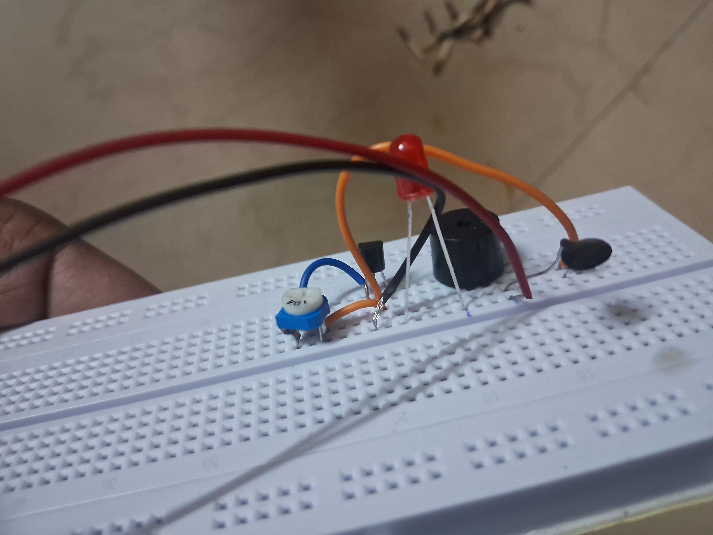
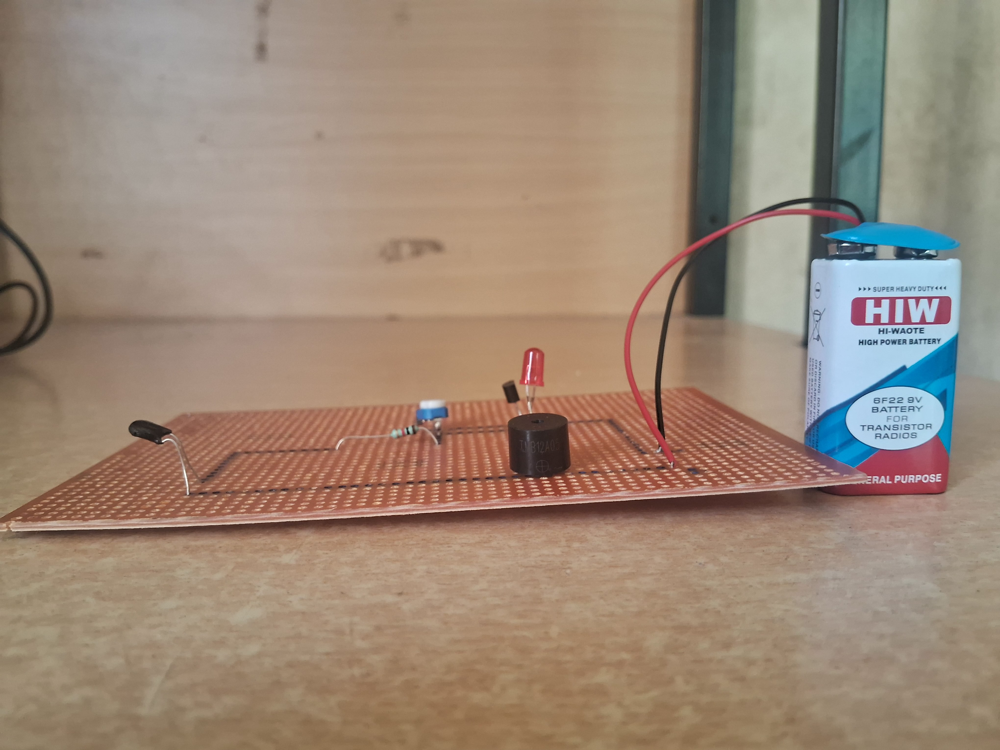
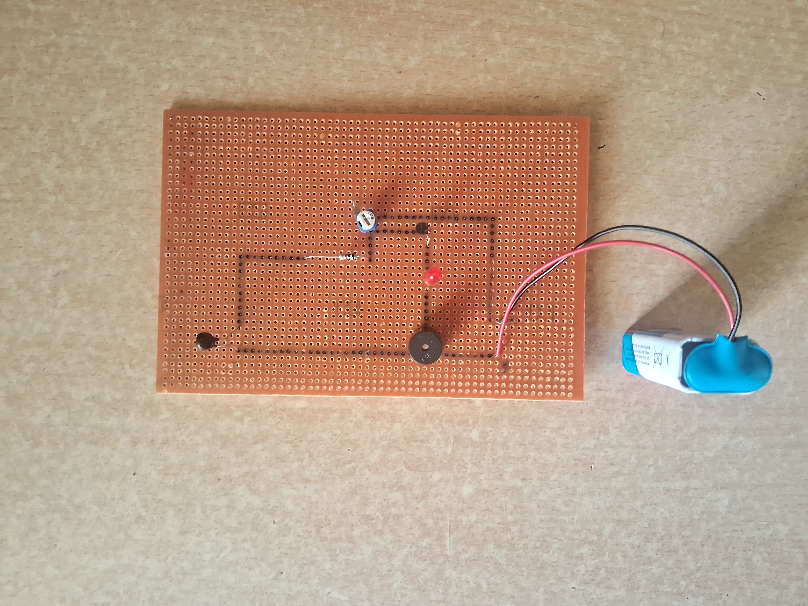

# 🔥 Advance Thermo-Resistive Fire Detection and Alert System

> A simple, no-microcontroller fire alarm built with pure analog electronics — because sometimes the old-school way just works.

---

## What's This About?

This is a mini-project we built during our 2nd semester of B.Tech Electrical Engineering at **SVNIT Surat**, as part of the **Electronic Devices & Circuits (EC108)** course. The idea was straightforward — build a fire detection system that can sense a rise in temperature and immediately scream (well, buzz) about it.

No Arduino. No code. No microcontroller. Just good old transistors, a thermistor, and a bit of circuit intuition.

---

## The Team

- **Nishant Tiwari**
- **Jyotirmoi Biswas**

**Timeline:** March – April 2026

---

## How Does It Actually Work?

At the heart of this circuit is an **NTC thermistor** — a resistor that doesn't like heat. As temperature goes up, its resistance drops. We used that simple property to trigger an alarm.

Here's the flow in plain English:

1. Everything's calm → thermistor resistance is high → transistor stays OFF → no alarm.
2. Fire (or heat) nearby → thermistor resistance drops → more current flows to the transistor's base → transistor switches ON → **buzzer sounds + LED lights up**.
3. A potentiometer lets you fine-tune how sensitive the circuit is, so you can set the exact temperature point at which the alarm goes off.

That's it. No firmware to flash, no libraries to install.

---

## Circuit Diagram

---

## Development Process

The circuit was first tested on a breadboard and later soldered onto a General Purpose PCB (Perfboard) for permanent implementation.

| Breadboard Prototype | Final PCB (Build 1) | Final PCB (Build 2) |
|---|---|---|
|  |  |  |

---

## Components Used

| Component | Quantity |
|---|---|
| BC547 NPN Transistor | 1 |
| NTC Thermistor (10 kΩ) | 1 |
| 10 kΩ Potentiometer | 1 |
| 220 Ω Resistor | 1 |
| Piezo Buzzer | 1 |
| Red LED | 1 |
| 9V Battery & Clip | 1 |
| General Purpose PCB (Perfboard) | 1 |

---

## What We Learned

Honestly, this project taught us a lot more than we expected going in:

- How NTC thermistors behave with changing temperature (and why they're so useful for sensing)
- How a BC547 transistor can be used as a switch, not just an amplifier
- The real-world skill of soldering components onto a PCB without frying them
- How to troubleshoot a circuit when it doesn't work the first time (spoiler: it never works the first time)
- What it feels like to actually *build* a safety system from scratch

---

## Where Can This Go From Here?

We kept things simple for the course, but there's a lot of room to grow this into something more serious:

- **Add an MQ-2 smoke sensor** — detect actual smoke, not just heat
- **Bring in an Arduino** — for smarter control, thresholds, and logging
- **Slap on an LCD/OLED display** — show the live temperature reading
- **Go IoT** — send alerts to your phone when things heat up
- **Battery monitor** — know when the system needs a recharge

---

## Acknowledgements

Big thanks to our course instructors and the lab staff at SVNIT Surat for their patience, guidance, and for letting us use the equipment. This wouldn't have come together without their support.

---

*Built with resistors, solder, and a healthy fear of fire 🔥*
